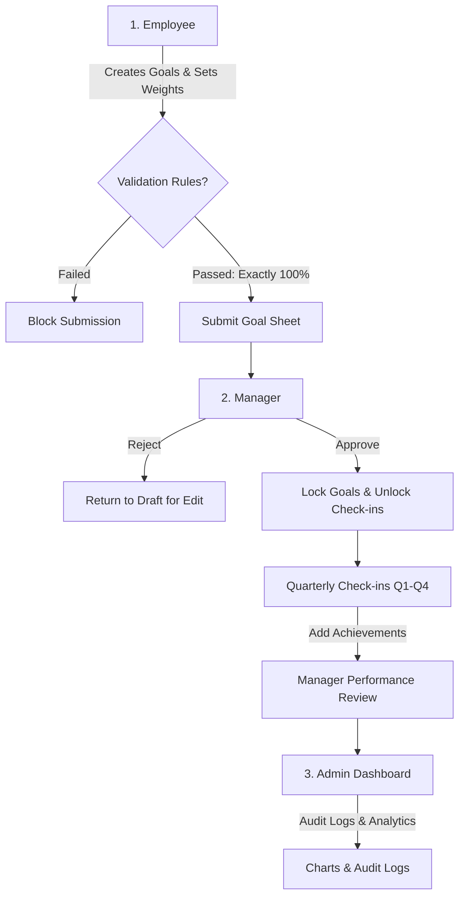
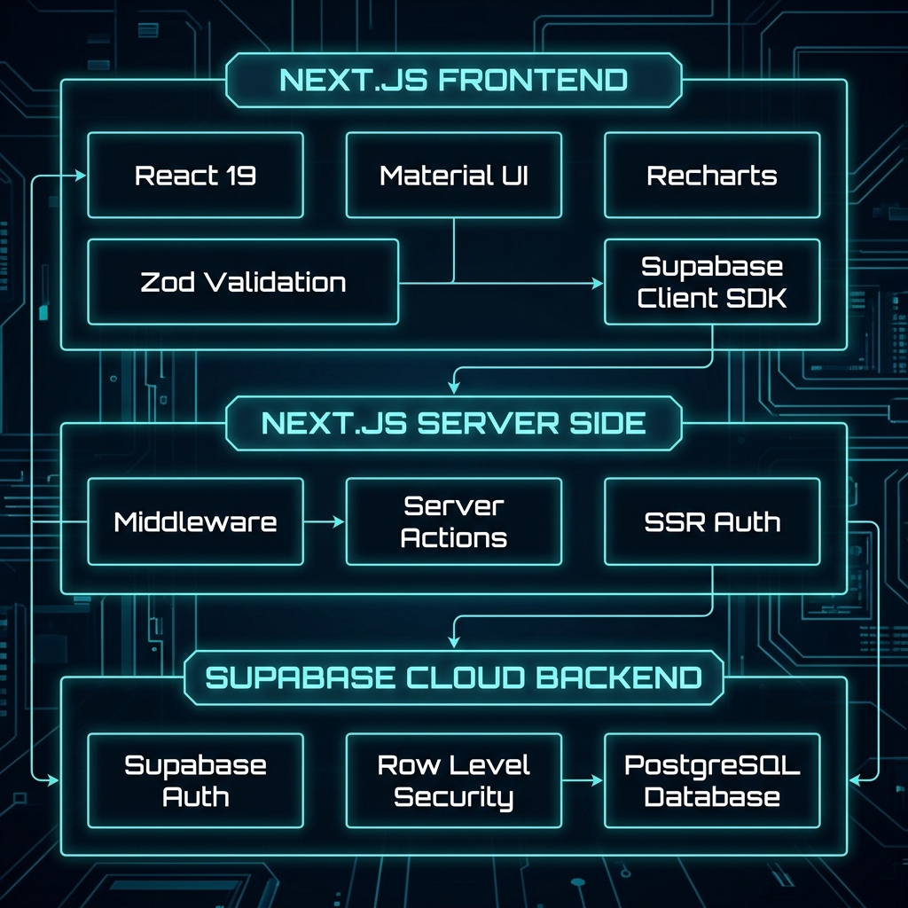
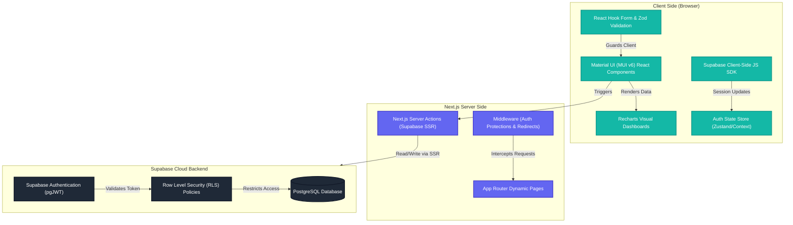

# 🚀 GoalDex — Futuristic Performance & Goal Alignment Platform

GoalDex is a next-generation, high-performance OKR (Objectives and Key Results) and employee performance management platform built for modern, forward-thinking enterprises. 

> [!IMPORTANT]
> ### ⚡ Live Demo & Credentials
> **Live URL**: [https://goaldex.vercel.app](https://goaldex.vercel.app)
> 
> You can log in using these pre-seeded hackathon accounts (or use the convenient **"Quick Login"** buttons on the live login page!):
> 
> | Role | Email | Password | Demo Persona |
> | :--- | :--- | :--- | :--- |
> | **Employee** | `employee@goaldex.com` | `goaldex123` | *Arjun Mehta (Engineering)* |
> | **Manager** | `manager@goaldex.com` | `goaldex123` | *Priya Sharma (Engineering Lead)* |
> | **Admin** | `admin@goaldex.com` | `goaldex123` | *Rahul Verma (Global HR Admin)* |

Traditional corporate HR tools are notorious for being slow, boring, spreadsheet-heavy, and confusing. **GoalDex completely reimagines this experience.** It combines a stunning **sci-fi cyberpunk visual aesthetic** with an ironclad **role-based workflow system** (Employee ➔ Manager ➔ Admin) and a precise **mathematical scoring engine** to make performance management engaging, transparent, and rock-solid.

---

## 🎨 The "Wow" Visual Design System

GoalDex is built to instantly capture attention and deliver an enterprise-grade, premium feel through state-of-the-art web design practices:

*   **Vibrant Dark Theme**: Designed with a deep, cinematic dark palette (`#0f0f1a` deep dark space, `#0a0a14` midnight black) layered with futuristic glowing neon accents (`#6366f1` indigo and `#14b8a6` teal).
*   **Premium Glassmorphism**: Cards, layouts, dialog overlays, and sidebars utilize a "frosted glass" look with semi-transparent background colors and hardware-accelerated blurs (`backdrop-filter: blur(16px)`).
*   **Interactive Micro-Animations**:
    *   **3D Hover Float**: Core dashboard cards lift up dynamically (`translateY(-4px)`) and project a glowing neon blue shadow when hovered.
    *   **Button Glows**: Buttons scale and cast colored neon glows when hovered.
    *   **Table Row Insets**: Tables feature a high-tech indicator highlight (a solid neon blue border slides in on the left edge of a row) and a slight scale-up when the cursor hovers over them.
*   **Holographic Easter Eggs**: Replaces boring spinners with a custom **3D Floating Coffee Cat (🐈)**. It is styled with a CSS `mix-blend-mode` to filter out its black background, creating a glowing holographic cat hovering over a pulsing shadow that dynamically shrinks and grows.

---

## 👥 The 3 Personas & Workflow Architecture

GoalDex coordinates a tight, role-based workflow across three distinct corporate personas:



### 🏗️ Tech Stack & System Architecture

Here is the high-level system architecture of the GoalDex platform:



#### Secure Data Flow Diagram (Mermaid)

Here is how the client, server, and database components interact securely in the GoalDex platform:



### 1. 👤 The Employee (Setting & Tracking Goals)
Employees own their goals. They have a full command center showing their cycle progress, current status, and weightage allocations.
*   **Strict Business Rules (Zod Validation)**:
    *   **Max 8 Goals**: Limits focus to critical priorities.
    *   **Min 10% Weightage**: Prevents trivial or filler goals.
    *   **Exact 100% Total Rule**: You cannot submit a goal sheet unless the sum of your goal weights is exactly 100%. The "Submit" button is locked with dynamic warnings until this is satisfied.
*   **Quarterly Check-ins**: At the end of Q1, Q2, Q3, and Q4, employees can check in to log achievements, update values, and leave comments.

### 2. 👥 The Manager (Reviewing & Adjusting)
Managers direct their teams and are responsible for aligning goals with company priorities.
*   **Review Dashboard**: View all direct reports and their submission statuses.
*   **Full Approval Control**: Approve sheets to lock them securely against employee tampering, or reject them back to "Draft" status with review comments.
*   **Target Adjustments**: Managers can edit the weightage and target values of goals before final approval.
*   **Check-in Feedback**: Add quarterly feedback, reviews, and approve achievements.

### 3. 👑 The Admin (Managing & Auditing)
Admins manage the system's global state and maintain total compliance.
*   **Visual Analytics**: Full-scale chart widgets showing completion heatmaps, goal statuses, manager review leaderboards, and quarterly performance trends.
*   **Immutable Audit Logs**: Automatically tracks every single database operation, displaying what table changed, who did it, when, and showcasing the raw `Old Values` vs `New Values` for total transparency.
*   **Shared Goals Push**: Create a company-wide priority (e.g. "Security Compliance") and push it instantly onto every employee's goal sheet. The title and target value remain locked so employees cannot delete or modify them.

---

## 🏆 The Complete Hackathon Demo Script

To experience the full capability of the GoalDex workflow, follow this step-by-step walkthrough:

### Phase 1: The Employee Sets & Submits Goals
1. Log in as **Employee** (`employee@goaldex.com` / `goaldex123`).
2. Go to **My Goals**. Notice the weightage is currently at **100%** using the seeded goals, and the "Submit for Approval" button is unlocked.
3. Click **Create Goal** and add a new goal (e.g., weightage: `20%`).
4. Look at the top bar. It will turn yellow, say **`⚠️ Over by 20%`**, and the "Submit for Approval" button will **automatically disable**.
5. Edit or delete goals until your total weightage drops back down to exactly **`100%`**. The indicator turns green, and the button unlocks!
6. Click **Submit for Approval**. Your sheet status changes to `Pending Approval`, and the edit/delete options instantly **lock**.

### Phase 2: The Manager Reviews & Approves
1. Log in as **Manager** (`manager@goaldex.com` / `goaldex123`).
2. Go to **Approvals** in the sidebar. You will see the Employee's submitted sheet waiting for you.
3. Click **Review**. You can inspect their goals, make adjustments to targets/weights, and write comments.
4. Click **Approve**. The employee's goals are now officially locked in the database, and the cycle status updates to `Approved`.

### Phase 3: The Check-in Cycle
1. Log in back as **Employee** (`employee@goaldex.com` / `goaldex123`).
2. Go to **Quarterly Check-ins**. 
3. Since your sheet is approved, check-ins are now unlocked! Select **Q1** from the cycle dropdown.
4. Update one of your goals to show progress (e.g., set Actual to `85` on an `85%` target) and click **Update Check-in**.
5. Watch the coffee cat float beautifully while your submission saves!

### Phase 4: Admin Oversight
1. Log in as **Admin** (`admin@goaldex.com` / `goaldex123`).
2. Go to the **Dashboard** and **Analytics** tabs to view real-time department charts.
3. Go to **Audit Logs** to view the exact record of who created, edited, approved, and updated goals—with detailed diffs showing exactly what values changed.

---

## 🧮 How the Scoring Engine Calculates Performance

GoalDex does not treat all goal metrics the same. It supports **four distinct Units of Measurement (UoM)**, each calculated using its own mathematical formula to translate raw inputs into weighted performance scores:

### 1. Numeric (Higher is Better)
*   *Use Case*: Sales targets, tech talk sessions, feature releases.
*   *Formula*: `(Actual / Target) * Weight`
*   *Example*: 
    *   Target: `12` tech talks.
    *   Actual: `9` tech talks.
    *   Weightage: `10%`
    *   **Score**: `(9 / 12) * 10 = 7.5%` out of a maximum `10%`.

### 2. Percentage (Higher is Better)
*   *Use Case*: Unit test code coverage, customer satisfaction index.
*   *Formula*: `(Actual / Target) * Weight`
*   *Example*: 
    *   Target: `85%` code coverage.
    *   Actual: `90%` code coverage.
    *   Weightage: `25%`
    *   **Score**: `(90 / 85) * 25 = 26.47%` (Supports over-achievement scoring!).

### 3. Timeline (Lower is Better)
*   *Use Case*: Projects delayed, bug resolution time.
*   *Formula*: `Max(0, 1 - (Actual - Target) / Target) * Weight`
*   *Example*: 
    *   Target: `5` days delayed maximum.
    *   Actual: `2` days delayed.
    *   Weightage: `15%`
    *   **Score**: `(1 - (2 - 5) / 5) * 15 = (1 - (-0.6)) * 15 = 1.6 * 15 = 24%` (scored for delivering ahead of schedule).
    *   *If delayed*: If delay was `8` days: `(1 - (8 - 5) / 5) * 15 = (1 - 0.6) * 15 = 6%`.

### 4. Zero-Based (Zero is 100%)
*   *Use Case*: Production bugs, critical server outages, compliance breaches.
*   *Formula*: `Actual == 0 ? 100% of Weight : 0% of Weight`
*   *Example*:
    *   Target: `0` server crashes.
    *   Actual: `0` server crashes ➔ **Score**: `100% of Weight`.
    *   Actual: `1` server crash ➔ **Score**: `0%`.

---

## 💾 Hardened Database Architecture

GoalDex runs on **PostgreSQL** backed by secure **Row Level Security (RLS)**. It guarantees that employees cannot manipulate data belonging to other accounts, and managers can only read data associated with their direct team members.

### Database Tables Breakdown

#### 1. `users`
Tracks system identities, hierarchy, and roles.
*   `id` (UUID, Primary Key): Links to Supabase Auth.
*   `email` (Text): Unique login address.
*   `full_name` (Text): User's profile name.
*   `role` (Text): Role constraint (`employee`, `manager`, `admin`).
*   `manager_id` (UUID, Nullable): Foreign key linking back to `users.id` for manager approvals.
*   `department` (Text): Department assignment (e.g. `Engineering`, `QA`).

#### 2. `goal_sheets`
Manages cycle status and locks.
*   `id` (UUID, Primary Key): Goal sheet identifier.
*   `employee_id` (UUID): Foreign key linking to `users.id`.
*   `cycle_year` (Integer): Cycle identifier (e.g. `2026`).
*   `status` (Text): Sheet status (`draft`, `pending`, `approved`).
*   `locked` (Boolean): Flag that hard-locks changes when set to `true`.
*   `manager_comments` (Text): Evaluation notes or rejection reasons.

#### 3. `goals`
Maintains individual performance metrics.
*   `id` (UUID, Primary Key): Goal identifier.
*   `goal_sheet_id` (UUID): Foreign key linking to `goal_sheets.id`.
*   `title` (Text): Goal heading.
*   `description` (Text): Details of the objective.
*   `thrust_area` (Text): Department pillar (e.g. `Quality`, `Technical Excellence`).
*   `uom_type` (Text): Measurement formula type (`numeric`, `percentage`, `timeline`, `zero_based`).
*   `target_value` (Numeric): Desired endpoint target.
*   `weightage` (Integer): Contribution weight percentage.
*   `is_shared_goal` (Boolean): Flag representing global admin-pushed goals.

#### 4. `checkins`
Saves progress records across quarterly reviews.
*   `id` (UUID, Primary Key): Checkin identifier.
*   `goal_id` (UUID): Foreign key linking to `goals.id` (cascades on delete).
*   `quarter` (Text): Quarter interval (`q1`, `q2`, `q3`, `q4`).
*   `actual_value` (Numeric): Value achieved during check-in.
*   `achievement_notes` (Text): Employee's notes on progress.
*   `status` (Text): Goal status (`not_started`, `on_track`, `delayed`, `completed`).
*   `manager_feedback` (Text): Review notes from evaluation.

#### 5. `audit_logs`
Tracks organizational changes for admin review.
*   `id` (UUID, Primary Key): Log identifier.
*   `actor_id` (UUID): Links to the user triggering the action.
*   `action` (Text): The event description (`CREATE`, `UPDATE`, `DELETE`, `APPROVE`, `REJECT`).
*   `table_name` (Text): The impacted table.
*   `record_id` (UUID): The primary key of the modified item.
*   `old_values` (JSONB): Stored prior database state.
*   `new_values` (JSONB): Stored new database state.

---

## 🛠️ Installation & Setup Instructions

To spin up GoalDex on your local workspace:

### 1. Requirements
*   **Node.js**: `v18.x` or higher installed.
*   **Supabase Account**: A free Supabase database project.

### 2. Project Installation
```bash
git clone https://github.com/yashashvialva/GoalDex.git
cd GoalDex
npm install
```

### 3. Configure Local Credentials
Create a `.env.local` file in your root folder and insert your Supabase Keys:
```env
NEXT_PUBLIC_SUPABASE_URL=your-supabase-project-url
NEXT_PUBLIC_SUPABASE_ANON_KEY=your-supabase-public-anon-key
```

### 4. Create Tables and Seed Data
1. Log in to your **Supabase Dashboard**.
2. Open the **SQL Editor** in the left sidebar.
3. Paste the contents of `supabase/migration.sql` and click **Run** to generate the database schema and RLS policies.
4. Open a new query window, paste the contents of `supabase/seed.sql`, and click **Run** to load all realistic demo accounts, cycles, goals, and history.

### 5. Launch the dev build
```bash
npm run dev
```
Open **[http://localhost:3000](http://localhost:3000)** in your browser!
